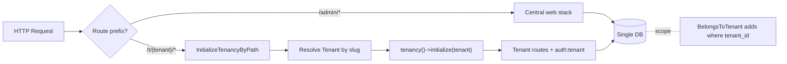

## Bối cảnh hiện tại

- Stack: Laravel 13 + Inertia + React, `stancl/tenancy ^3.10`
- Mode hiện tại: **multi-DB** (subdomain identification, mỗi tenant 1 DB riêng `tenant_<uuid>`)
- Tenant DB chứa: `staff`, `fields`, `customers`, `field_prices`, `bookings`, `recurring_bookings`, `field_special_events`, `payments`, `sessions`, `cache`
- Central DB chứa: `users`, `tenants`, `domains`, `plans`, `field_types`, `subscriptions`, `subscription_payments`

## Quyết định kiến trúc đã chốt

- Identification: **path-based** `/t/{tenantSlug}/...`
- Bootstrappers: **bỏ hết** (chỉ dùng `tenancy()->initialize($tenant)` + `BelongsToTenant` scope)
- Data hiện có: drop & migrate fresh
- Phân loại model: dùng pattern **đơn giản nhất** — thêm `tenant_id` cho **tất cả** bảng tenant-scoped và áp `BelongsToTenant` trait đồng đều (tránh edge-case `BelongsToPrimaryModel` cho chuỗi `Payment → Booking → Field`)

## Phân loại Model sau refactor

- **Global** (không scope): `[Tenant](app/Models/Tenant.php)`, `[Plan](app/Models/Plan.php)`, `[FieldType](app/Models/FieldType.php)`
- **BelongsToTenant** (đã có `tenant_id`): `[User](app/Models/User.php)`, `[Subscription](app/Models/Subscription.php)`, `[SubscriptionPayment](app/Models/SubscriptionPayment.php)`
- **BelongsToTenant** (cần thêm `tenant_id`): `[Staff](app/Models/Tenant/Staff.php)`, `[Field](app/Models/Tenant/Field.php)`, `[Customer](app/Models/Tenant/Customer.php)`, `[FieldPrice](app/Models/Tenant/FieldPrice.php)`, `[Booking](app/Models/Tenant/Booking.php)`, `[RecurringBooking](app/Models/Tenant/RecurringBooking.php)`, `[FieldSpecialEvent](app/Models/Tenant/FieldSpecialEvent.php)`, `[Payment](app/Models/Tenant/Payment.php)`
- **Bị xoá**: `[Domain](app/Models/Domain.php)` (thay bằng `slug` trên `tenants`)

## Sơ đồ luồng request sau refactor




## Thay đổi cụ thể theo file

### 1. Config & providers

- `config/tenancy.php`:
  - `bootstrappers` → mảng rỗng `[]`
  - Xoá nguyên block `database` (không cần) hoặc giữ để phòng hờ
  - Xoá `migration_parameters`, `seeder_parameters` (không còn `tenants:migrate`)
  - Có thể xoá `central_domains` (path-based không cần)
  - Bỏ `domain_model`
  - Cấu hình tham số path: `Stancl\Tenancy\Resolvers\PathTenantResolver::$tenantParameterName = 'tenant'` (default), không cache
- `[app/Providers/TenancyServiceProvider.php](app/Providers/TenancyServiceProvider.php)`:
  - `events()`: **xoá listener** `JobPipeline` cho `TenantCreated` (CreateDatabase/MigrateDatabase/SeedDatabase) và `TenantDeleted` (DeleteDatabase) — để mảng rỗng
  - `mapRoutes()`: gói `routes/tenant.php` bằng prefix `'t/{tenant}'`

```php
Route::middleware('web')
    ->prefix('t/{tenant}')
    ->group(base_path('routes/tenant.php'));
```

### 2. Tenant model & xoá Domain

- `[app/Models/Tenant.php](app/Models/Tenant.php)`:
  - Xoá `implements TenantWithDatabase`, bỏ trait `HasDatabase`, `HasDomains`
  - Bỏ relation `domains()` ngầm (đã ở trong `HasDomains`)
  - Thêm `'slug'` vào `getCustomColumns()`
  - Dùng `HasScopedValidationRules` trait để hỗ trợ validation
  - Có thể dùng `Stancl\Tenancy\Database\Models\Tenant` làm parent (đã implement contract `Tenant`) — giữ để `tenancy()->initialize()` còn hoạt động
- Xoá `[app/Models/Domain.php](app/Models/Domain.php)`

### 3. Migrations

- **Sửa** `[2019_09_15_000010_create_tenants_table.php](database/migrations/2019_09_15_000010_create_tenants_table.php)`: thêm `$table->string('slug')->unique();`
- **Xoá** `[2019_09_15_000020_create_domains_table.php](database/migrations/2019_09_15_000020_create_domains_table.php)`
- **Di chuyển** 8 migration trong `[database/migrations/tenant/](database/migrations/tenant/)` ra `database/migrations/`, đổi tên timestamp cho phù hợp thứ tự, và **thêm** `$table->foreignUuid/string('tenant_id')->constrained()->cascadeOnDelete();` vào mỗi bảng:
  - `staff`: thêm `tenant_id`, đổi unique `email` thành unique `(tenant_id, email)`
  - `fields`: thêm `tenant_id`, foreign `field_type_id` → `field_types`
  - `customers`: thêm `tenant_id`, unique `(tenant_id, phone)` (mới)
  - `field_prices`: thêm `tenant_id`, đổi unique cũ thành `(tenant_id, field_type_id, start_time, end_time, day_type)`
  - `bookings`, `recurring_bookings`, `field_special_events`, `payments`: thêm `tenant_id`
- **Xoá** `[tenant/2026_04_06_000001_create_sessions_table.php](database/migrations/tenant/2026_04_06_000001_create_sessions_table.php)` và `[tenant/2026_04_06_000002_create_cache_tables.php](database/migrations/tenant/2026_04_06_000002_create_cache_tables.php)` (đã có ở central qua `0001_01_01_`*)
- Sau khi di chuyển hết, xoá thư mục rỗng `database/migrations/tenant/`

### 4. Models áp dụng `BelongsToTenant`

Mỗi model thêm:

```php
use Stancl\Tenancy\Database\Concerns\BelongsToTenant;

class Field extends Model
{
    use BelongsToTenant;
    // ...
}
```

Áp cho 11 model (đã liệt kê ở mục Phân loại). Đồng thời xoá dòng `protected $connection = 'mysql'` trong `[FieldType.php](app/Models/FieldType.php)` (single DB không cần).

`User` model: trait `BelongsToTenant` sẽ overlap với relation `tenant()` đã có — bỏ method `tenant()` thủ công vì trait đã cung cấp.

### 5. Routes

- `[routes/web.php](routes/web.php)`: không đổi nhiều, chỉ giữ admin + register
- `[routes/tenant.php](routes/tenant.php)` **viết lại**:

```php
use Stancl\Tenancy\Middleware\InitializeTenancyByPath;

Route::middleware([InitializeTenancyByPath::class])
    ->group(function () {
        Route::middleware('guest:tenant')->group(function () {
            Route::get('/login', [AuthenticatedTenantSessionController::class, 'create'])
                ->name('tenant.login');
            Route::post('/login', [AuthenticatedTenantSessionController::class, 'store'])
                ->middleware('throttle:10,1');
        });

        Route::middleware('auth:tenant')->group(function () {
            Route::post('/logout', [AuthenticatedTenantSessionController::class, 'destroy'])
                ->name('tenant.logout');
            Route::get('/dashboard', fn () => Inertia::render('Tenant/TenantDashboard'))
                ->name('tenant.dashboard');
        });
    });
```

(Khi prefix `t/{tenant}` được gắn ở `TenancyServiceProvider`, `route('tenant.dashboard', ['tenant' => $slug])` sẽ sinh ra `/t/{slug}/dashboard`.)

### 6. Bootstrap & redirect

`[bootstrap/app.php](bootstrap/app.php)` — cập nhật closures:

```php
$middleware->redirectGuestsTo(function (Request $request) {
    if (tenancy()->initialized) {
        return route('tenant.login', ['tenant' => tenant()->slug]);
    }
    return route('admin.login');
});

$middleware->redirectUsersTo(function (Request $request) {
    if (tenancy()->initialized && auth('tenant')->check()) {
        return route('tenant.dashboard', ['tenant' => tenant()->slug]);
    }
    return route('admin.dashboard');
});
```

### 7. Tenant registration service

`[TenantRegistrationService.php](app/Services/Tenant/TenantRegistrationService.php)` — đơn giản hoá đáng kể:

```php
$tenant = Tenant::create([
    'name'      => $data['tenant_name'],
    'slug'      => strtolower($data['slug']),
    'phone'     => $data['tenant_phone'] ?? null,
    'address'   => $data['tenant_address'] ?? null,
    'is_active' => true,
]);

User::create([
    'tenant_id' => $tenant->id,
    'name'      => $data['owner_name'],
    'email'     => $data['owner_email'],
    'password'  => $data['owner_password'],
    'role'      => UserRole::TenantOwner,
    'phone'     => $data['tenant_phone'] ?? null,
    'is_active' => true,
]);

Tenancy::initialize($tenant);
Staff::create([
    'name' => $data['owner_name'], 'email' => $data['owner_email'],
    'phone' => $data['tenant_phone'] ?? null,
    'password' => Hash::make($data['owner_password']),
    'role' => StaffRole::Manager, 'is_active' => true,
]);
Tenancy::end();

return [
    'tenant'    => $tenant,
    'login_url' => route('tenant.login', ['tenant' => $tenant->slug]),
];
```

`Tenancy::initialize` cần thiết để `BelongsToTenant::creating` tự gán `tenant_id` cho `Staff`. Bỏ logic `domains()->create()` và `resolveBaseDomain()`.

### 8. Validation

- `[RegisterTenantRequest](app/Http/Requests/Tenant/RegisterTenantRequest.php)`: thêm rule `'slug' => [..., Rule::unique('tenants', 'slug')]`
- Các unique theo tenant trong tương lai: dùng `tenant()->unique('table', 'column')` qua trait `HasScopedValidationRules` đã thêm vào `Tenant` model

### 9. Seeder

- `[TenantDatabaseSeeder.php](database/seeders/TenantDatabaseSeeder.php)` và `[TenantFieldPriceSeeder.php](database/seeders/TenantFieldPriceSeeder.php)` hiện tại được gọi tự động qua `Jobs\SeedDatabase`. Sau refactor: **xoá file** vì:
  - `field_prices` giờ thuộc về tenant cụ thể, không seed mặc định được
  - Logic seed sẽ chuyển vào `TenantRegistrationService` (sau khi tạo tenant + initialize, seed price mặc định cho tenant đó)
- `DatabaseSeeder` giữ nguyên (Plan, Admin, FieldType là global)

### 10. Frontend

- Các trang React render qua Inertia ít dùng `route()` helper kiểu PHP, nhưng có 1 số form action. Sau khi đổi route prefix, mọi link đến tenant route phải có `tenant` slug param. Cần rà soát:
  - `[resources/js/Pages/Tenant/Login.tsx](resources/js/Pages/Tenant/Login.tsx)`
  - `[resources/js/Pages/Tenant/TenantDashboard.tsx](resources/js/Pages/Tenant/TenantDashboard.tsx)`
  - Component `TenantHeader.tsx`, `TenantSidebar.tsx`, `TenantLayout.tsx`
- Kế hoạch: share `tenant.slug` qua `[HandleInertiaRequests::share()](app/Http/Middleware/HandleInertiaRequests.php)` khi `tenancy()->initialized`, để frontend dùng cho mọi link và form

### 11. Cleanup cuối

- Bỏ `Stancl\Tenancy\UUIDGenerator` cũng được (dùng UUID hay slug làm id đều ok) — **giữ UUID**, dùng slug riêng làm key path
- Có thể xoá `[config/tenancy.php](config/tenancy.php)` các block `cache`, `redis`, `filesystem`, `features` không dùng (không bắt buộc)

## Thứ tự thực thi đề xuất

1. Migrations (1-3): cập nhật `tenants`, xoá `domains`, gộp tenant migrations vào central
2. Models (4): áp `BelongsToTenant`, xoá `Domain.php`, làm gọn `Tenant.php`, `FieldType.php`
3. Tenancy config + provider (1): tắt bootstrappers + DB jobs, mount route prefix
4. Routes + bootstrap (5-6): viết lại tenant routes, sửa redirect callbacks
5. Service + validation (7-8): đơn giản hoá `TenantRegistrationService`, thêm rule slug
6. Seeders (9): xoá tenant seeder, tích hợp default price vào registration
7. Frontend (10): share slug qua Inertia, rà soát link
8. `php artisan migrate:fresh --seed` rồi smoke-test: đăng ký tenant mới, login `/t/{slug}/login`, vào dashboard

